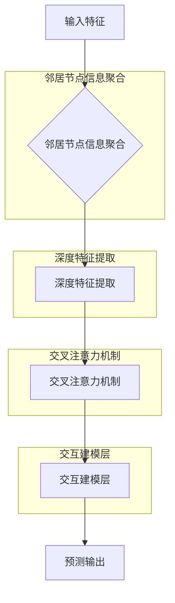
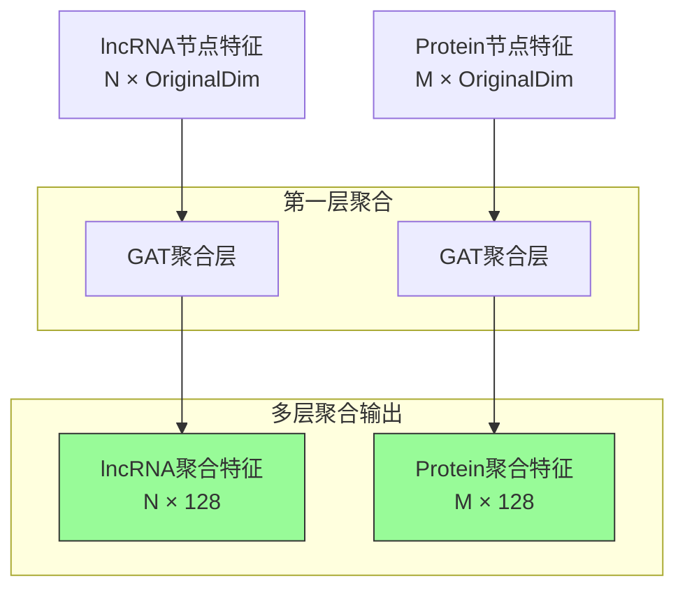
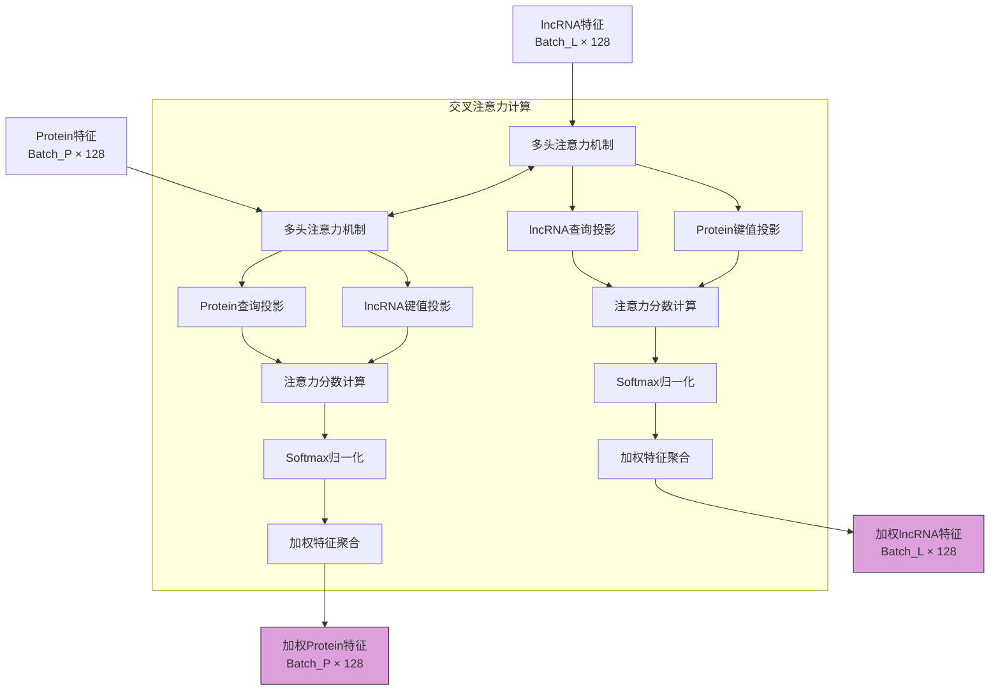

# PLLPI 模型结构图

## 1. 整体架构



## 2. 经过一维卷积层自适应平均池化层

```mermaid
graph LR
    A[输入特征\nBatch × FeatureDim × SeqLen] --> B[Conv1D Layer 1\nKernel=3, Padding=1\nReLU激活]
    B --> C[Conv1D Layer 2\nKernel=3, Padding=1\nReLU激活]
    C --> D[AdaptiveAvgPool1D\n输出长度固定为10]
    D --> E[展平操作\nBatch × (HiddenDim × 10)]
    E --> F[Linear映射\n输出128维特征]
    
    style D fill:#ffe4c4,stroke:#333
```

## 3. 邻居节点信息聚合后特征维度



## 4. 深度特征提取后维度

```mermaid
graph TD
    A[输入特征<br/>Batch × 128 × 1] --> B[第一层卷积<br/>Conv1D(128->64)<br/>Kernel=3, Padding=1]
    B --> C[8层残差卷积块]
    
    subgraph 残差卷积块
        C --> D[Conv1D Layer<br/>64->64<br/>Kernel=3, Padding=1]
        D --> E[ReLU + Dropout]
        E --> F[残差连接]
        F --> G[...重复8次...]
    end
    
    G --> H[AdaptiveAvgPool1D<br/>输出长度固定为10]
    H --> I[展平<br/>Batch × 640]
    I --> J[Linear映射<br/>640->128]
    J --> K[输出特征<br/>Batch × 128]
    
    style K fill:#87ceeb,stroke:#333
```

## 5. 交叉注意力后维度



## 6. 交互建模层

```mermaid
graph TD
    A[lncRNA加权特征<br/>Batch × 128] --> B[特征拼接]
    C[Protein加权特征<br/>Batch × 128] --> B
    B --> D[拼接后特征<br/>Batch × 256]
    
    subgraph 交互建模层
        D --> E[Linear(256->128)<br/>+ ReLU + Dropout]
        E --> F[Linear(128->128)<br/>+ ReLU]
        F --> G[交互特征<br/>Batch × 128]
    end
    
    subgraph 预测层
        G --> H[Linear(128->64)<br/>+ ReLU + Dropout]
        H --> I[Linear(64->1)<br/>输出预测结果]
        I --> J[Batch × 1]
    end
    
    style G fill:#f0e68c,stroke:#333
    style J fill:#f0e68c,stroke:#333
```

## 各模块维度变化总结

| 模块 | 输入维度 | 输出维度 | 说明 |
|------|----------|----------|------|
| 邻居节点信息聚合 | N×OriginalDim, M×OriginalDim | N×128, M×128 | 使用GAT进行邻居信息聚合 |
| 深度特征提取 | Batch×128×1 | Batch×128 | 8层残差卷积+自适应池化 |
| 交叉注意力 | Batch_L×128, Batch_P×128 | Batch_L×128, Batch_P×128 | 双向注意力机制 |
| 交互建模 | Batch×256 | Batch×128 | 特征融合与高阶交互建模 |
| 预测层 | Batch×128 | Batch×1 | 最终二分类预测结果 |